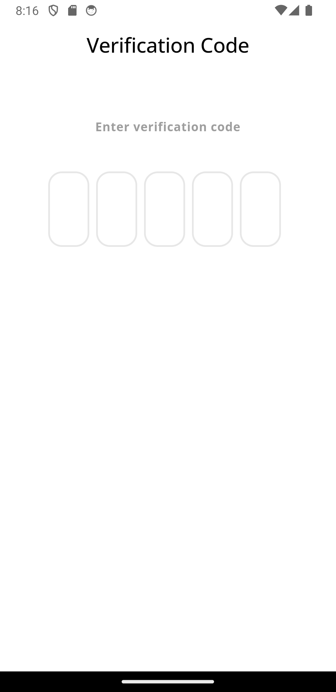

# ZingoShop: A Complete Flutter E-commerce Solution (Single-Vendor)

This project is a fully functional single-vendor e-commerce application built with Flutter for the frontend (user app, admin app, and delivery app) and PHP with MySQL for the backend. It's designed to be cross-platform, working seamlessly on both Android and iOS devices. 

## Table of Contents

* [Project Overview](#project-overview)
* [Features](#features)
* [Architecture](#architecture)
* [Frontend (Flutter)](#frontend-flutter)
* [Backend (PHP/MySQL)](#backend-phpmysql)
* [Firebase Integration](#firebase-integration)
* [Installation and Setup](#installation-and-setup)
* [ZingoShop Backend API Documentation](#zingoshop-backend-api-documentation) 
* [Screenshots](#screenshots)
* [Future Improvements](#future-improvements)
* [Contributing](#contributing) 

## Project Overview

   
  <!-- 
    -->

ZingoShop empowers a single vendor to establish a complete online store, providing tools to manage products, process orders, track deliveries, and engage with customers. This robust system comprises three distinct Flutter applications:

* **User App:** Allows customers to browse products, add items to their cart, proceed through checkout, track orders, manage addresses, and view notifications.
* **Admin App:** Provides a comprehensive interface for the vendor to manage products (adding, editing, deleting), processing orders (accepting, rejecting, preparing), viewing sales data, and configuring app settings.
* **Delivery App:** Equips delivery personnel with the ability to view assigned orders, update order statuses in real-time, and efficiently track delivery locations using integrated maps. 

## Features

* **User Authentication:** 
    * Secure user registration and login using email and password.
    * Email verification for account activation, enhancing security.
    * Streamlined password reset functionality with email verification. 
* **Product Browsing:**
    * Intuitive browsing of products organized by category.
    * Detailed product pages displaying name, description, price, and multiple images.
    * Efficient search functionality to quickly locate desired products.
* **Cart Management:**
    * Add items to the cart seamlessly.
    * Update item quantities for greater control over purchases.
    * Remove unwanted items from the cart.
* **Checkout:**
    * Selection of preferred shipping address (if applicable).
    * Choice of payment method, including cash on delivery and secure payment card options. 
    * Application of coupon codes for discounts, boosting customer engagement.
    * Order confirmation with detailed order summary.
* **Order Management:**
    * View pending orders with their current status.
    * Access a comprehensive order history of archived orders.
    * Detailed order information for transparent tracking.
    * Option to cancel orders, subject to the vendor's policy.
    * Rate completed orders to provide valuable feedback.
* **Address Management:**
    * Add, edit, and delete shipping addresses for accurate delivery.
    * Integration with Google Maps facilitates address selection and validation. 
* **Notifications:**
    * Stay up-to-date with real-time push notifications for order updates, promotions, and other relevant events, powered by Firebase Cloud Messaging. 
* **Admin Features:**
    * Comprehensive product management, including adding, editing, deleting products, and managing categories.
    * Efficient order management, including accepting, rejecting, and preparing orders.
    * Flexible configuration of app settings, such as delivery time and home screen content.
* **Delivery Features:**
    * View assigned orders for clear visibility.
    * Real-time updates to order statuses (e.g., picked up, on the way, delivered).
    * Seamless order tracking using integrated Google Maps for efficient delivery.

## Architecture 

* **Frontend (Flutter):**  The Flutter apps adhere to the Model-View-Controller (MVC) pattern, promoting clean code organization and separation of concerns. The `Get` package provides powerful state management and navigation capabilities. 
* **Backend (PHP/MySQL):**  The backend is built with PHP, leveraging a MySQL database for data persistence. The codebase is logically structured into folders for different features, including authentication, categories, items, orders, and notifications, ensuring maintainability and scalability.
* **Communication:** The frontend and backend communicate seamlessly using a RESTful API, enabling data exchange in a standardized JSON format.

## Frontend (Flutter)

* **Code Organization:** 
    * `lib/`: The primary source code directory for each Flutter app.
    * `lib/bindings/`:  Handles dependency injection for efficient management of dependencies.
    * `lib/core/`:  Contains essential elements like core classes, constants, helper functions, localization settings, middleware, and app-wide services. 
    * `lib/data/`: Houses data models that represent the application's data structures and data sources for accessing both remote and static data. 
    * `lib/controller/`:  The heart of the app's logic, containing controllers that manage the state and behavior of different screens and features.
    * `lib/view/`:  Defines the user interface, housing the layout and widgets for each screen in the app. 
* **Key Packages:**
    * `flutter_screenutil`: Enables responsive UI design, adapting layouts to various screen sizes.
    * `cached_network_image`:  Ensures efficient image loading and caching, optimizing performance and user experience. 
    * `get`:  Provides powerful state management, dependency injection, and navigation capabilities, streamlining development. 
    * `flutter_map`: Integrates Google Maps functionality for features like order tracking and address selection. 
    * `firebase_messaging`: Powers real-time push notifications, keeping users informed about updates and events.

## Backend (PHP/MySQL)

* **Code Organization:** 
    * `connect.php`:  Establishes and configures the connection to the MySQL database. 
    * `functions.php`:  Contains utility functions for common tasks, such as image uploads, notification handling, and data manipulation.
    * `view.sql`: Defines SQL views that simplify data retrieval and optimize database performance.
    * Feature-specific folders: Organized to enhance maintainability and scalability (e.g., `auth`, `categories`, `items`, `orders`, `notification`).
* **API Endpoints:** The backend exposes well-defined RESTful API endpoints to handle requests from the Flutter applications, facilitating data exchange and application logic.  

## Firebase Integration

Firebase Cloud Messaging (FCM) seamlessly integrates into the project to enable real-time push notifications to users. Notifications inform users about order updates, promotions, and other crucial events.

## Installation and Setup

1. **Clone the repository:**  `git clone [repository URL]`
2. **Install Flutter dependencies:**  `flutter pub get` (run this command in each Flutter app's directory - user, admin, and delivery). 
3. **Set up the backend:** 
    * Create a MySQL database and import the provided database schema (`view.sql`). 
    * Configure the database connection credentials in `connect.php`.
    * Deploy the PHP backend code to a web server for remote access. 
4. **Configure Firebase:**
    * Create a Firebase project and obtain the necessary configuration files.
    * Integrate the Firebase configuration into each of the Flutter applications (user, admin, and delivery).
5. **Run the Flutter apps:** `flutter run` (run this command in each Flutter app's directory to launch the app on an emulator or a connected device).

## ZingoShop Backend API Documentation

This documentation outlines the RESTful API endpoints for the ZingoShop backend. The API facilitates communication between the Flutter frontend applications (user, admin, and delivery) and the PHP/MySQL backend.

**Base URL:** [Your Base URL] (e.g., `http://yourdomain.com/ecommerce_from_host/`)

**Data Format:** JSON

**Authentication:** 
- Some endpoints may require authentication using API keys or tokens.
- You can implement a basic authentication mechanism using headers (e.g., `Authorization: Basic base64_encoded(username:password)`).

**Error Handling:** 
- The API will return a JSON response with a `status` field indicating "success" or "failure."
- In case of errors, a `message` field will provide details about the error.

## Endpoints

### 1. Authentication Endpoints

| Endpoint | Method | Description | Request Parameters | Response Example |
|---|---|---|---|---|
| `/auth/signup.php` | `POST` | Registers a new user. | `name`, `email`, `phone`, `password` | `{ "status": "success" }` |
| `/auth/verifycode.php` | `POST` | Verifies a user's email using a code. | `email`, `verifyCode` | `{ "status": "success" }` |
| `/auth/login.php` | `POST` | Logs in an existing user. | `email`, `password` | `{ "status": "success", "data": { "user_id": 123, "user_name": "John Doe", ...} }` |
| `/auth/resentverifycode.php` | `POST` | Resends the verification code. | `email` | `{ "status": "success" }` |
| `/auth/forget_password/checkemail.php` | `POST` | Checks if an email exists for password reset. | `email` | `{ "status": "success" }` |
| `/auth/forget_password/reset_password.php` | `POST` | Resets the user's password. | `email`, `password` | `{ "status": "success" }` |
| `/auth/forget_password/verifycode.php` | `POST` | Verifies the password reset code. | `email`, `verifyCode` | `{ "status": "success" }` |

- **Admin and Delivery Authentication:** 
    - You have similar endpoints for admin (`/admin/auth/...`) and delivery personnel (`/delivery/auth/...`) with corresponding parameters and responses.

### 2. Home and Product Endpoints

| Endpoint | Method | Description | Request Parameters | Response Example |
|---|---|---|---|---|
| `/home.php` | `GET` | Retrieves home screen data (categories, top-selling items, settings). |  None | `{ "status": "success", "categories": [...], "itemsTopSellingView": [...], "home_cart_settings": [...] }` |
| `/search.php` | `POST` | Searches for products. | `search` | `{ "status": "success", "data": [...] }` |
| `/items/items.php` | `POST` | Retrieves items for a specific category. | `users_id`, `categories_id` | `{ "status": "success", "data": [...] }` |
| `/offers.php` | `GET` | Retrieves products with discounts. |  None | `{ "status": "success", "data": [...] }` |

### 3. Favorite Endpoints

| Endpoint | Method | Description | Request Parameters | Response Example |
|---|---|---|---|---|
| `/favorite/addtofavorite.php` | `POST` | Adds an item to a user's favorites. | `users_id`, `items_id` | `{ "status": "success" }` |
| `/favorite/removefromfavorite.php` | `POST` | Removes an item from favorites. | `users_id`, `items_id` | `{ "status": "success" }` |
| `/favorite/view.php` | `POST` | Retrieves a user's favorite items. | `users_id` | `{ "status": "success", "data": [...] }` |
| `/favorite/deletefavorite.php` | `POST` | Deletes a favorite item. | `favorite_id` | `{ "status": "success" }` |

### 4. Cart Endpoints

| Endpoint | Method | Description | Request Parameters | Response Example |
|---|---|---|---|---|
| `/cart/add.php` | `POST` | Adds an item to the cart. | `user_id`, `item_id`, `item_count` | `{ "status": "success" }` |
| `/cart/delete.php` | `POST` | Deletes an item from the cart. | `user_id`, `item_id` | `{ "status": "success" }` |
| `/cart/view.php` | `POST` | Retrieves the user's cart items and total price. | `user_id` | `{ "status": "success", "countprice": {...}, "datacart": [...] }` |

### 5. Address Endpoints

| Endpoint | Method | Description | Request Parameters | Response Example |
|---|---|---|---|---|
| `/address/add.php` | `POST` | Adds a new address. | `user_id`, `name`, `city`, `street`, `lat`, `long` | `{ "status": "success" }` |
| `/address/delete.php` | `POST` | Deletes an address. | `address_id` | `{ "status": "success" }` |
| `/address/view.php` | `POST` | Retrieves a user's addresses. | `user_id` | `{ "status": "success", "data": [...] }` |
| `/address/update.php` | `POST` | Updates an address. | `address_id`, `name`, `city`, `street`, `lat`, `long` | `{ "status": "success" }` | 

### 6. Coupon Endpoint

| Endpoint | Method | Description | Request Parameters | Response Example |
|---|---|---|---|---|
| `/coupon/checkCoupon.php` | `POST` | Checks if a coupon is valid and retrieves details. | `coupon_name` | `{ "status": "success", "data": {...} }` |

### 7. Order Endpoints

| Endpoint | Method | Description | Request Parameters | Response Example |
|---|---|---|---|---|
| `/order/checkout.php` | `POST` | Creates a new order. | `user_id`, `address_id`, `order_type`, `delivery_price`, `order_price`, `coupon_id`, `coupon_discount`, `payment_type` | `{ "status": "success" }` |
| `/order/pending.php` | `POST` | Retrieves pending orders for a user. | `user_id` | `{ "status": "success", "data": [...] }` |
| `/order/archive.php` | `POST` | Retrieves archived orders for a user. | `user_id` | `{ "status": "success", "data": [...] }` |
| `/order/details.php` | `POST` | Retrieves details of a specific order. | `order_id` | `{ "status": "success", "data": [...] }` |
| `/order/delete.php` | `POST` | Deletes an order (if allowed). | `order_id` | `{ "status": "success" }` |
| `/order/rating.php` | `POST` | Adds a rating to an order. | `order_id`, `order_rating`, `order_notating` | `{ "status": "success" }` |

- **Admin Order Endpoints:** 
    - You have specific endpoints for admin order management (`/admin/order/...`), such as approve, prepare, and archive.
- **Delivery Order Endpoints:** 
    - Similarly, you have endpoints for delivery personnel (`/delivery/order/...`), including done, archive, pending, approve, and accepted.

### 8. Notification Endpoints

| Endpoint | Method | Description | Request Parameters | Response Example |
|---|---|---|---|---|
| `/notification/view.php` | `POST` | Retrieves notifications for a user. | `user_id` | `{ "status": "success", "data": [...] }` |

**[Add more endpoints as needed based on your backend functionality]**

## Screenshots 

**Language Selection:**

  

**Onboarding:** 

  

**User Authentication:**

    
    

**Home:**

**Offers:**

 

**Product Browsing:**

   
 

**Product Details:**

**Cart:**

   

**Addresses:**

  

**Add Address:**

 

**Checkout:**

   

**Orders:**

 

**Order Details:**

 

**Order Tracking:**

 

**Favorites:**

 

**Notifications:**

 

**Settings:**

 

## Future Improvements

* **Payment Integration:** Integrate with a reliable payment gateway to facilitate secure online transactions, expanding payment options for customers. 
* **User Reviews:**  Enable customers to leave reviews for products, fostering community engagement and providing valuable feedback for other shoppers.
* **Advanced Search/Filtering:** Implement more sophisticated search and product filtering options to enhance product discovery and help customers find exactly what they need.
* **Enhanced Security:** Conduct a thorough security audit and implement robust measures to protect against common vulnerabilities, such as SQL injection and cross-site scripting (XSS), ensuring data integrity and user privacy. 
* **Extensive Testing:** Implement a comprehensive testing strategy, including unit, integration, and end-to-end tests to maintain code quality, identify potential issues early, and ensure application reliability.
* **Performance Optimization:**  Continuously optimize database queries, API interactions, and the backend architecture for better scalability and responsiveness, especially as the user base and product catalog grow. 

## Contributing

Contributions to this project are welcome! If you find a bug, have a feature request, or want to improve the code, please feel free to open an issue or submit a pull request.