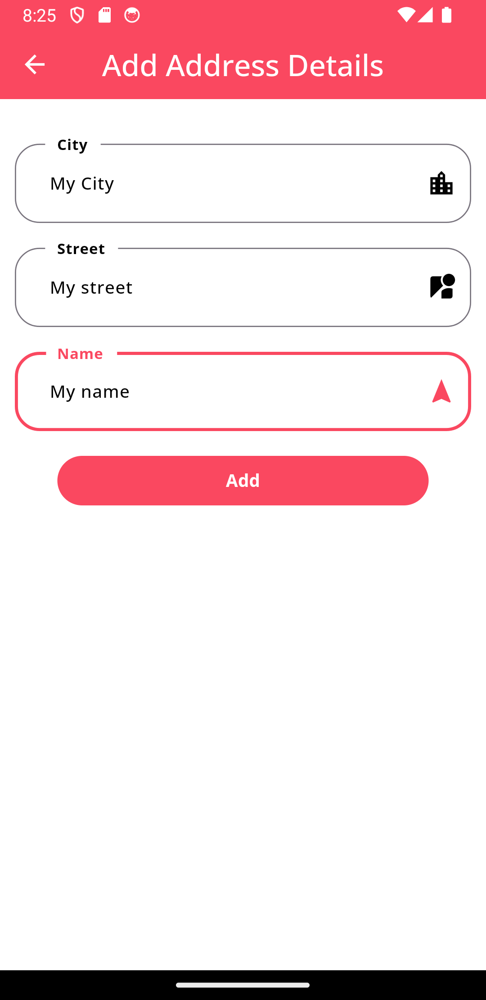

# ZingoShop: A Complete Flutter E-commerce Solution (Single-Vendor)

   
  <!-- 
    -->

This project is a fully functional single-vendor e-commerce application built with Flutter for the frontend (user app, admin app, and delivery app) and PHP with MySQL for the backend. It's designed to be cross-platform, working seamlessly on both Android and iOS devices.

## Table of Contents

* [Project Overview](#project-overview)
* [Features](#features)
* [Screenshots](#screenshots)
* [Architecture](#architecture)
* [Frontend (Flutter)](#frontend-flutter)
* [Backend (PHP/MySQL)](#backend-phpmysql)
* [Firebase Integration](#firebase-integration)
* [Installation and Setup](#installation-and-setup)
* [Backend and API](#backend-and-api)
* [Future Improvements](#future-improvements)
* [Contributing](#contributing)

## Project Overview

ZingoShop empowers a single vendor to establish a complete online store, providing tools to manage products, process orders, track deliveries, and engage with customers. This robust system comprises three distinct Flutter applications:

* **User App:** Allows customers to browse products, add items to their cart, proceed through checkout, track orders, manage addresses, and view notifications.
* **Admin App:** Provides a comprehensive interface for the vendor to manage products (adding, editing, deleting), processing orders (accepting, rejecting, preparing), viewing sales data, and configuring app settings.
* **Delivery App:** Equips delivery personnel with the ability to view assigned orders, update order statuses in real-time, and efficiently track delivery locations using integrated maps. 

## Features

* **User Authentication:** 
    * Secure user registration and login using email and password.
    * Email verification for account activation, enhancing security.
    * Streamlined password reset functionality with email verification. 
* **Product Browsing:**
    * Intuitive browsing of products organized by category.
    * Detailed product pages displaying name, description, price, and multiple images.
    * Efficient search functionality to quickly locate desired products.
* **Cart Management:**
    * Add items to the cart seamlessly.
    * Update item quantities for greater control over purchases.
    * Remove unwanted items from the cart.
* **Checkout:**
    * Selection of preferred shipping address (if applicable).
    * Choice of payment method, including cash on delivery and secure payment card options. 
    * Application of coupon codes for discounts, boosting customer engagement.
    * Order confirmation with detailed order summary.
* **Order Management:**
    * View pending orders with their current status.
    * Access a comprehensive order history of archived orders.
    * Detailed order information for transparent tracking.
    * Option to cancel orders, subject to the vendor's policy.
    * Rate completed orders to provide valuable feedback.
* **Address Management:**
    * Add, edit, and delete shipping addresses for accurate delivery.
    * Integration with Google Maps facilitates address selection and validation. 
* **Notifications:**
    * Stay up-to-date with real-time push notifications for order updates, promotions, and other relevant events, powered by Firebase Cloud Messaging. 
* **Admin Features:**
    * Comprehensive product management, including adding, editing, deleting products, and managing categories.
    * Efficient order management, including accepting, rejecting, and preparing orders.
    * Flexible configuration of app settings, such as delivery time and home screen content.
* **Delivery Features:**
    * View assigned orders for clear visibility.
    * Real-time updates to order statuses (e.g., picked up, on the way, delivered).
    * Seamless order tracking using integrated Google Maps for efficient delivery.

## Screenshots

### Language Selection & Onboarding

| Language Selection | Onboarding |
|:---:|:---:|
|   |    |

### User Authentication

| Login & Sign Up | Password Reset |
|:---:|:---:|
|     |     |

### Home & Offers

| Home | Offers |
|:---:|:---:|
|  |  |

### Product Browsing & Details

| Product Browsing | Product Details |
|:---:|:---:|
|      |  |

### Cart & Checkout

| Cart | Checkout |
|:---:|:---:|
|    |    |

### Addresses

| Address List | Add Address |
|:---:|:---:|
|   |  |

### Orders

| Order List | Order Details | Order Tracking |
|:---:|:---:|:---:|
|  |  |  |

### Additional Features

| Favorites | Notifications | Settings |
|:---:|:---:|:---:|
|  |  |  |

## Architecture 

* **Frontend (Flutter):**  The Flutter apps adhere to the Model-View-Controller (MVC) pattern, promoting clean code organization and separation of concerns. The `Get` package provides powerful state management and navigation capabilities. 
* **Backend (PHP/MySQL):**  The backend is built with PHP, leveraging a MySQL database for data persistence. The codebase is logically structured into folders for different features, including authentication, categories, items, orders, and notifications, ensuring maintainability and scalability.
* **Communication:** The frontend and backend communicate seamlessly using a RESTful API, enabling data exchange in a standardized JSON format.

## Frontend (Flutter)

* **Code Organization:** 
    * `lib/`: The primary source code directory for each Flutter app.
    * `lib/bindings/`:  Handles dependency injection for efficient management of dependencies.
    * `lib/core/`:  Contains essential elements like core classes, constants, helper functions, localization settings, middleware, and app-wide services. 
    * `lib/data/`: Houses data models that represent the application's data structures and data sources for accessing both remote and static data. 
    * `lib/controller/`:  The heart of the app's logic, containing controllers that manage the state and behavior of different screens and features.
    * `lib/view/`:  Defines the user interface, housing the layout and widgets for each screen in the app. 
* **Key Packages:**
    * `flutter_screenutil`: Enables responsive UI design, adapting layouts to various screen sizes.
    * `cached_network_image`:  Ensures efficient image loading and caching, optimizing performance and user experience. 
    * `get`:  Provides powerful state management, dependency injection, and navigation capabilities, streamlining development. 
    * `flutter_map`: Integrates Google Maps functionality for features like order tracking and address selection. 
    * `firebase_messaging`: Powers real-time push notifications, keeping users informed about updates and events.

## Backend (PHP/MySQL)

* **Code Organization:** 
    * `connect.php`:  Establishes and configures the connection to the MySQL database. 
    * `functions.php`:  Contains utility functions for common tasks, such as image uploads, notification handling, and data manipulation.
    * `view.sql`: Defines SQL views that simplify data retrieval and optimize database performance.
    * Feature-specific folders: Organized to enhance maintainability and scalability (e.g., `auth`, `categories`, `items`, `orders`, `notification`).
* **API Endpoints:** The backend exposes well-defined RESTful API endpoints to handle requests from the Flutter applications, facilitating data exchange and application logic.  

## Firebase Integration

Firebase Cloud Messaging (FCM) seamlessly integrates into the project to enable real-time push notifications to users. Notifications inform users about order updates, promotions, and other crucial events.

## Installation and Setup

1. **Clone the repository:**  `git clone [repository URL]`
2. **Install Flutter dependencies:**  `flutter pub get` (run this command in each Flutter app's directory - user, admin, and delivery). 
3. **Set up the backend:** 
    * Create a MySQL database and import the provided database schema (`view.sql`). 
    * Configure the database connection credentials in `connect.php`.
    * Deploy the PHP backend code to a web server for remote access. 
4. **Configure Firebase:**
    * Create a Firebase project and obtain the necessary configuration files.
    * Integrate the Firebase configuration into each of the Flutter applications (user, admin, and delivery).
5. **Run the Flutter apps:** `flutter run` (run this command in each Flutter app's directory to launch the app on an emulator or a connected device).

## Backend and API

This app communicates with a PHP/MySQL backend to manage product data, user accounts, orders, and other e-commerce functionalities. The interaction between the app and the backend is facilitated through a RESTful API. 

For detailed API documentation, please refer to the [ZingoShop Backend repository](https://github.com/RotRot-pi/ZingoShop-Backend).

## Future Improvements

* **Payment Integration:** Integrate with a reliable payment gateway to facilitate secure online transactions, expanding payment options for customers. 
* **User Reviews:**  Enable customers to leave reviews for products, fostering community engagement and providing valuable feedback for other shoppers.
* **Advanced Search/Filtering:** Implement more sophisticated search and product filtering options to enhance product discovery and help customers find exactly what they need.
* **Enhanced Security:** Conduct a thorough security audit and implement robust measures to protect against common vulnerabilities, such as SQL injection and cross-site scripting (XSS), ensuring data integrity and user privacy. 
* **Extensive Testing:** Implement a comprehensive testing strategy, including unit, integration, and end-to-end tests to maintain code quality, identify potential issues early, and ensure application reliability.
* **Performance Optimization:**  Continuously optimize database queries, API interactions, and the backend architecture for better scalability and responsiveness, especially as the user base and product catalog grow. 

## Contributing

Contributions to this project are welcome! If you find a bug, have a feature request, or want to improve the code, please feel free to open an issue or submit a pull request.